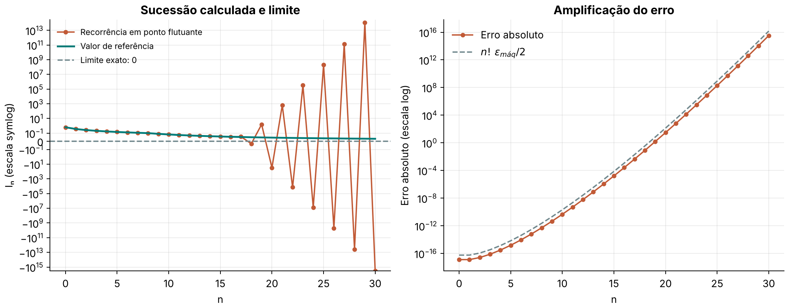
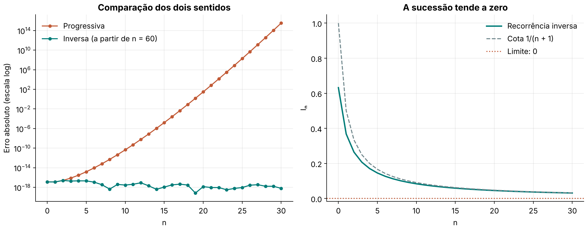

# Lista 1 - Exercício 3

## Problema

Calcular a sucessão

```math
I_0=\frac{1}{e}(e-1),\qquad I_{n+1}=1-(n+1)I_n,\qquad n=0,1,2,\dots
```

e comparar o resultado com o limite exato, I_n → 0 quando n → ∞ (Berbert, 2026, questão 3).

## Solução

A solução foi feita em Python. O arquivo [3.py](3.py) faz os cálculos e mostra os resultados. O [3-graph.py](3-graph.py) faz os mesmos cálculos e também gera os gráficos desta resolução.

### O que a sucessão representa

Integrando por partes, é possível mostrar que

```math
I_n=\int_0^1 x^n e^{x-1}\,dx.
```

Para n = 0, a integral vale 1 − e⁻¹ = (e − 1)/e, que é o valor inicial do enunciado. Para n ≥ 0, a integração por partes dá I_{n+1} = 1 − (n + 1)Iₙ, que é a recorrência.

No intervalo [0, 1), temos e^{x−1} < 1 e e^{x−1} ≥ e⁻¹. Logo,

```math
\frac{1}{e(n+1)}\leq I_n<\frac{1}{n+1}.
```

Então Iₙ é sempre positivo e tende a zero, como o enunciado afirma. A queda é lenta, no ritmo de 1/n.

### Recorrência em ponto flutuante

Calculamos I₀ com `math.e` e aplicamos a recorrência até n = 30. Para saber o erro, usamos uma referência com 150 dígitos, calculada com `Decimal` pela mesma recorrência. O erro inicial dessa referência, de ordem 10⁻¹⁵⁰, é multiplicado por n! e continua desprezível para n ≤ 60. O erro de cada valor em ponto flutuante é medido com `Decimal.from_float`, que preserva exatamente o número binário calculado pelo computador.

| n | Iₙ calculado | Iₙ de referência | Erro absoluto |
|---:|---:|---:|---:|
| 0 | 6,321206 × 10⁻¹ | 6,321206 × 10⁻¹ | 1,243 × 10⁻¹⁷ |
| 5 | 1,455329 × 10⁻¹ | 1,455329 × 10⁻¹ | 1,491 × 10⁻¹⁵ |
| 10 | 8,387707 × 10⁻² | 8,387707 × 10⁻² | 4,510 × 10⁻¹¹ |
| 15 | 5,903379 × 10⁻² | 5,901754 × 10⁻² | 1,625 × 10⁻⁵ |
| 17 | 5,719187 × 10⁻² | 5,277112 × 10⁻² | 4,421 × 10⁻³ |
| 18 | −2,945367 × 10⁻² | 5,011985 × 10⁻² | 7,957 × 10⁻² |
| 20 | −3,019239 × 10¹ | 4,554488 × 10⁻² | 3,024 × 10¹ |
| 25 | 1,927850 × 10⁸ | 3,708621 × 10⁻² | 1,928 × 10⁸ |
| 30 | −3,296762 × 10¹⁵ | 3,127967 × 10⁻² | 3,297 × 10¹⁵ |



**Figura 1:** à esquerda, a sucessão calculada em ponto flutuante e a referência; o eixo vertical usa a escala symlog para mostrar valores positivos e negativos muito diferentes. À direita, o erro absoluto em escala logarítmica e a curva n!·ε/2, em que ε = 2⁻⁵³.

Os primeiros valores concordam com a referência, mas o erro cresce a cada passo. Já em n = 17 o valor calculado, 0,0572, passa da cota 1/(n + 1) = 0,0556, que Iₙ nunca poderia ultrapassar. Em n = 18 o resultado fica negativo, e depois disso os valores oscilam e crescem em módulo. A sucessão calculada **não** tende a zero, ao contrário da exata.

### Por que o erro cresce

Seja eₙ o erro de Iₙ. Se o erro inicial é e₀, a recorrência dá

```math
e_{n+1}=-(n+1)\,e_n\quad\Longrightarrow\quad |e_n|=n!\,|e_0|.
```

Na recorrência, o erro de cada passo é multiplicado por n + 1, então o erro inicial é amplificado por n!. O erro inicial medido foi **1,243 × 10⁻¹⁷**, que vem do arredondamento de I₀ para 53 bits. Para n = 30, 30! · 1,243 × 10⁻¹⁷ = 3,297 × 10¹⁵, valor igual ao erro observado na tabela. A recorrência é instável: o problema não está na precisão de I₀, e sim no algoritmo, que multiplica o erro por um fator cada vez maior.

### Recorrência inversa

Isolando Iₙ₋₁ na recorrência, obtemos

```math
I_{n-1}=\frac{1-I_n}{n}.
```

Agora o erro de cada passo é dividido por n. Partimos de I₆₀ = 0, que erra por menos que 1/61 (pela cota acima), e caminhamos para trás até n = 0. Esse erro inicial é reduzido a cada passo e já é desprezível em n = 30.

| n | Iₙ (inversa) | Erro absoluto |
|---:|---:|---:|
| 0 | 0,632120558828558 | 1,243 × 10⁻¹⁷ |
| 5 | 0,145532940573079 | 2,040 × 10⁻¹⁷ |
| 10 | 0,083877070103394 | 2,902 × 10⁻¹⁸ |
| 20 | 0,045544884075818 | 1,365 × 10⁻¹⁸ |
| 30 | 0,031279673932168 | 6,120 × 10⁻¹⁹ |



**Figura 2:** à esquerda, o erro absoluto da recorrência progressiva (que cresce) e o da inversa (que fica no nível do arredondamento). À direita, a sucessão obtida pela recorrência inversa, entre a cota 1/(n + 1) e o limite zero.

Os erros ficam entre 10⁻¹⁷ e 10⁻¹⁹, que é o nível de arredondamento do próprio valor de ponto flutuante. A sucessão obtida decresce e se mantém abaixo de 1/(n + 1), como esperado. Por exemplo, I₃₀ = 0,0312797, que está próximo de zero, mas ainda longe dele: o limite é atingido devagar.

## Conclusão

A sucessão exata tende a 0, mas a recorrência progressiva, calculada em ponto flutuante, perde toda a precisão por volta de n = 17 e depois diverge, porque o erro é multiplicado por n!. A recorrência inversa calcula os mesmos valores com erro próximo do arredondamento. O exemplo mostra que dois algoritmos equivalentes em teoria podem ter comportamentos muito diferentes na prática: o que importa é como o erro se propaga.

## Como executar

No terminal, dentro desta pasta:

```bash
python 3.py
python -m pip install matplotlib
python 3-graph.py
```

O `3.py` usa apenas bibliotecas que já vêm com o Python. A versão com gráficos precisa do Matplotlib e salva `ex3.png` e `ex3-estabilidade.png` nesta pasta. Os dois arquivos funcionam separadamente.

## Referências

- BERBERT, Juliana. *Cálculo Numérico: Lista 1 de problemas*. UFABC, 3º quadrimestre de 2026. Questão 3. [Lista original](https://drive.google.com/file/d/1qNxuEqhAeqAXgKFEFL0H5pBrh-1pkWOa/view).
- PYTHON SOFTWARE FOUNDATION. *Floating-Point Arithmetic: Issues and Limitations*. Tutorial oficial do Python, s.d. Representação binária e arredondamento. [Tutorial sobre ponto flutuante](https://docs.python.org/3/tutorial/floatingpoint.html).

Referências consultadas em 7 de outubro de 2026. A indicação “s.d.” significa que a página não informa uma data de publicação.
