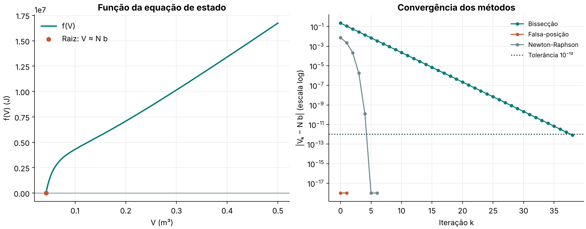
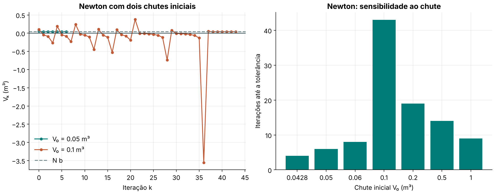

# Lista 1 - Exercício 8

## Problema

Determinar o volume ocupado por N = 1000 moléculas de CO₂ a T = 300 K e p = 3,5 × 10⁷ Pa, usando a equação de estado

```math
\left[p+a\left(\frac{N}{V}\right)^2\right](V-Nb)=kNT,
```

com a = 0,401 Pa m³, b = 42,7 × 10⁻⁶ m³ e k = 1,3806503 × 10⁻²³ J K⁻¹. O enunciado pede o método da bissecção com tolerância de 10⁻¹², e também os métodos da falsa-posição e de Newton-Raphson (Berbert, 2026, questão 8).

## Solução

A solução foi feita em Python. O arquivo [8.py](8.py) faz os cálculos e mostra os resultados. O [8-graph.py](8-graph.py) faz os mesmos cálculos e também gera os gráficos desta resolução. Os dados foram usados exatamente como aparecem no enunciado, de modo que N b = 1000 × 42,7 × 10⁻⁶ = 0,0427 m³. Observação: valores de a e b desse tipo costumam ser dados por mol, e não por molécula. Com N = 1000 moléculas, o resultado, V ≈ N b, é um volume bem maior que o de 1000 moléculas reais. A resolução numérica abaixo segue o enunciado e não depende dessa discussão.

Passando tudo para um lado, queremos a raiz de

```math
f(V)=\left[p+a\left(\frac{N}{V}\right)^2\right](V-Nb)-kNT,
\qquad
f'(V)=p+\frac{aN^2}{V^2}-\frac{2aN^2(V-Nb)}{V^3}.
```

O volume só faz sentido para V > N b. Nesse extremo, f(N b) = −kNT = −4,142 × 10⁻¹⁸, que é negativo, e f(0,5) = 1,674 × 10⁷, que é positivo. Portanto, há uma raiz em [N b, 0,5], e esse intervalo serve de partida para a bissecção e a falsa-posição. O gráfico da Figura 1 mostra uma função crescente nesse intervalo.



**Figura 1:** à esquerda, f(V) em [N b, 0,5]. À direita, o erro |Vₖ − N b| de cada método em escala logarítmica; valores abaixo de 10⁻¹⁸ aparecem no piso do gráfico.

### Resultados

Nos três métodos, a condição de parada é |Vₖ₊₁ − Vₖ| ≤ 10⁻¹² (na bissecção, o meio-comprimento do intervalo), com no máximo 10.000 iterações.

| Método | Dados iniciais | V (m³) | f(V) | Iterações |
|---|---|---:|---:|---:|
| Bissecção | [N b, 0,5] | 0,04270000000083 | 2,121 × 10⁻⁴ | 39 |
| Falsa-posição | [N b, 0,5] | 0,0427 | −4,142 × 10⁻¹⁸ | 2 |
| Newton-Raphson | V₀ = 0,05 | 0,0427 | −4,142 × 10⁻¹⁸ | 6 |

O volume obtido pelos três métodos é **V ≈ 0,0427 m³**, igual a N b dentro da tolerância pedida. Para comparação, o gás ideal (p V = N k T) daria V = 1,18 × 10⁻²⁵ m³, que está muito abaixo de N b e não tem sentido nesta equação. Nessas condições, de pressão altíssima, o volume ocupado é quase todo o volume excluído N b.

### Bissecção

A cada passo, o intervalo é dividido ao meio. O intervalo inicial mede 0,4573 m³, e depois de k passos o meio-comprimento é 0,4573 / 2ᵏ. Para ficar abaixo de 10⁻¹², é preciso k ≥ log₂(0,4573 / 10⁻¹²) ≈ 38,7, ou seja, **39** iterações, que foi o resultado do programa. O número de iterações depende só do tamanho do intervalo e da tolerância, não da função: com 0,05 e 1 como extremo direito, as contas dão 32,8 e 39,8, e o programa fez 33 e 40 iterações (NIST, seção 3.8(iii), sobre a bissecção).

O resíduo f(V) = 2,121 × 10⁻⁴ parece grande, mas é coerente: o erro em V é 8,3 × 10⁻¹³, e a inclinação de f perto da raiz é de cerca de 2,55 × 10⁸, então 8,3 × 10⁻¹³ × 2,55 × 10⁸ ≈ 2,1 × 10⁻⁴. A inclinação é grande porque p + a(N/V)² vale 2,55 × 10⁸ Pa em V = N b.

### Falsa-posição

O método usa a reta entre (a, f(a)) e (b, f(b)) e escolhe como novo ponto o zero dessa reta (NIST, seção 3.8(iii), equação 3.8.6). Como f(N b) é quase zero (−4,1 × 10⁻¹⁸) e f(0,5) é enorme, o zero da reta fica praticamente em N b, e o método parou em **2** iterações para qualquer extremo direito testado (0,05; 0,5 e 1).

Isso merece cuidado. A falsa-posição tem convergência apenas linear (NIST, seção 3.8(iii)), e, quando um extremo do intervalo não muda, a diferença entre dois passos consecutivos pode ser pequena sem que o método tenha convergido. Aqui o resultado está correto, mas por uma razão específica: a raiz está tão perto de N b que o primeiro ponto já coincide com ela em precisão de ponto flutuante. Em outro problema, esse critério de parada poderia enganar, e seria prudente testar também |f(V)|.

### Newton-Raphson

A iteração é Vₖ₊₁ = Vₖ − f(Vₖ)/f'(Vₖ) (NIST, seção 3.8(ii), equação 3.8.4). Com V₀ = 0,05, o método chegou à raiz em 6 iterações:

| k | Vₖ (m³) | \|Vₖ − N b\| |
|---:|---:|---:|
| 0 | 0,050000000000 | 7,300 × 10⁻³ |
| 1 | 0,040398564382 | 2,301 × 10⁻³ |
| 2 | 0,042491291929 | 2,087 × 10⁻⁴ |
| 3 | 0,042698243757 | 1,756 × 10⁻⁶ |
| 4 | 0,042699999875 | 1,246 × 10⁻¹⁰ |
| 5 | 0,042700000000 | 0 |

Nas iterações 2 a 4, a razão entre o erro e o quadrado do erro anterior fica em torno de 40, o que indica convergência quadrática: o número de dígitos corretos mais ou menos dobra a cada passo. Isso é muito mais rápido que a bissecção, mas depende do chute inicial.



**Figura 2:** à esquerda, Newton com V₀ = 0,05 (6 iterações) e com V₀ = 0,1 (43 iterações, passando por valores negativos de V). À direita, o número de iterações para outros chutes.

| Chute inicial V₀ (m³) | 0,0428 | 0,05 | 0,06 | 0,1 | 0,2 | 0,5 | 1 |
|---|---:|---:|---:|---:|---:|---:|---:|
| Iterações | 4 | 6 | 8 | 43 | 19 | 14 | 9 |

Com chutes próximos de N b, Newton converge rápido. Com V₀ = 0,1, o primeiro passo cai em V < 0, onde a equação não tem significado físico, e a sequência oscila até voltar para a vizinhança da raiz, gastando 43 iterações. Uma causa é a curvatura de f: f''(V) = 2aN²(V − 3N b)/V⁴, que é negativa para V < 3N b ≈ 0,128. Nessa região f é côncava, a tangente fica acima do gráfico e o zero da tangente pode ultrapassar a raiz. Como a raiz está colada em V = N b, e a equação tem um polo em V = 0, a ultrapassagem pode jogar o ponto para V negativo. Já a bissecção e a falsa-posição não saem do intervalo inicial.

### Precisão numérica

Quanto o volume realmente difere de N b? Resolvendo a equação com 60 dígitos, na forma w = kNT / (p + aN²/(N b + w)²) com w = V − N b, obtemos

```math
V-Nb\approx1{,}6247\times10^{-26}\ \text{m}^3.
```

Esse valor é menor que o espaçamento entre dois números de ponto flutuante vizinhos de 0,0427, que é 6,94 × 10⁻¹⁸. Por isso, o computador não consegue distinguir V de N b: o valor em ponto flutuante de V é o próprio N b, e a raiz fica entre N b e o próximo número representável (nesse ponto, f vale 1,77 × 10⁻⁹, positivo). Os três métodos encontram esse mesmo valor, e a tolerância de 10⁻¹² está muito acima dessa resolução.

## Conclusão

O volume de 1000 moléculas de CO₂ nas condições dadas é V ≈ 0,0427 m³, praticamente igual a N b. A bissecção é segura e precisou de 39 iterações para a tolerância pedida. A falsa-posição terminou em 2 iterações, mas por uma coincidência do problema, e seu critério de parada exige cuidado. Newton é o mais rápido (6 iterações, convergência quadrática), porém sensível ao chute inicial.

## Como executar

No terminal, dentro desta pasta:

```bash
python 8.py
python -m pip install numpy matplotlib
python 8-graph.py
```

O `8.py` usa apenas bibliotecas que já vêm com o Python. A versão com gráficos precisa de NumPy e Matplotlib e salva `ex8.png` e `ex8-newton.png` nesta pasta. Os dois arquivos funcionam separadamente.

## Referências

- BERBERT, Juliana. *Cálculo Numérico: Lista 1 de problemas*. UFABC, 3º quadrimestre de 2026. Questão 8. [Lista original](https://drive.google.com/file/d/1qNxuEqhAeqAXgKFEFL0H5pBrh-1pkWOa/view).
- NIST — NATIONAL INSTITUTE OF STANDARDS AND TECHNOLOGY. *Digital Library of Mathematical Functions*. Seção 3.8, *Nonlinear Equations*: Newton em 3.8(ii) (equação 3.8.4); bissecção e falsa-posição em 3.8(iii) (equação 3.8.6). [Seção consultada](https://dlmf.nist.gov/3.8).
- PYTHON SOFTWARE FOUNDATION. *Floating-Point Arithmetic: Issues and Limitations*. Tutorial oficial do Python, s.d. Representação binária e arredondamento. [Tutorial sobre ponto flutuante](https://docs.python.org/3/tutorial/floatingpoint.html).

Referências consultadas em 7 de outubro de 2026. A indicação “s.d.” significa que a página não informa uma data de publicação.
